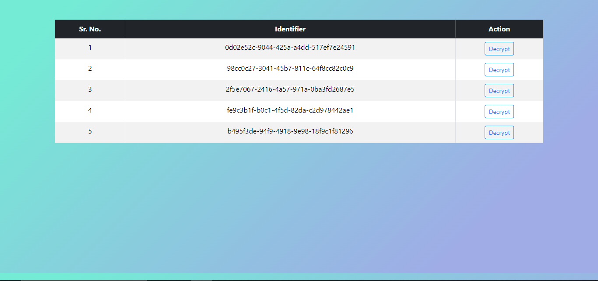
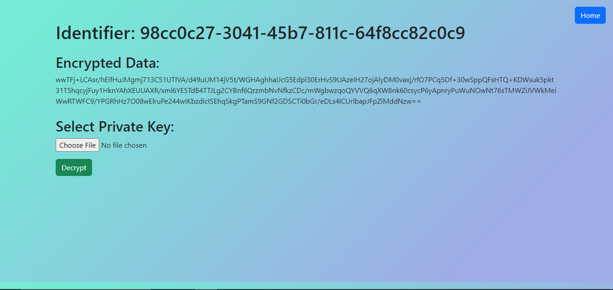
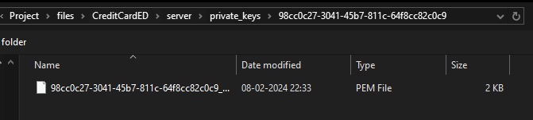
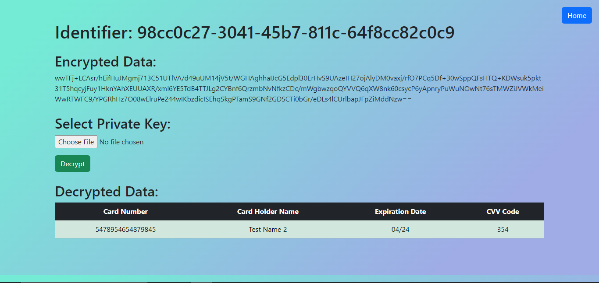

# Web Based Credit Card Encryption and Decryption System

<!---
[](https://github.com/Patel-Aum-28/CreditCardED/blob/master/LICENSE)
[](https://github.com/Patel-Aum-28/CreditCardED/issues)
[](https://github.com/Patel-Aum-28/CreditCardED/network)
[](https://github.com/Patel-Aum-28/CreditCardED/stargazers)
--->

## Introduction
This project provides a solution for securely encrypting and decrypting credit card information. It consists of two components: a client-side application for encrypting credit card data and a server-side application for decrypting the encrypted data using a private key. This is also a part of my internship program at SlashMark, given as Task-4.

## Features
- Encrypt credit card information securely.
- Decrypt encrypted credit card data using a private key.
- User-friendly web interface for both client and server components.
- Secure encryption and decryption using RSA asymmetric cryptography.

## How to Use

### Client Side
1. Access the client application by running app and navigating to `http://127.0.0.1:8000/client/`.
2. Enter the credit card information and submit the form to encrypt the data.
3. All the generated keys are stored in `/CreditCardED/server/private_keys/`, which can be used later on to decrypt the data.

### Server Side
1. Access the server application by navigating to `http://127.0.0.1:8000/server/`.
2. Upload the private key used for encryption.
3. View the decrypted credit card information.

## Setup
1. Clone the repository:
```bash
git clone https://github.com/Patel-Aum-28/CreditCardED.git
```

2. Make virtual environment:
```bash
python -m venv virtualenv_name
```
- Activate virtual environment:

    - For Linux:
        ```bash
        source virtualenv_name/bin/activate
        ```

3. Navigate to Directory:
```bash
cd CreditCardED
```

4. Install dependencies:
```bash
pip install -r requirements.txt
```

5. Run the development server:
```bash
python manage.py runserver
```

6. Access the client and server applications as described above.

## Accessing Django Admin
You can access the Django admin interface to manage encrypted data and to configure the app. Follow these steps:

1. Navigate to `http://127.0.0.1:8000/admin` in your web browser.
2. Log in using your admin credentials(default is "admin"/"password").
3. You can now view and manage encrypted data from the admin interface.

## Screenshots

### Client Side


- Here success msg popup when the data is stored in database, otherwise it shows warning popup.

### Server Side

- List of available info shows here.


- Click on any button will redirect here, where you can see encrypted information.


- You can choose key from following directory:
`CredCardED/server/private_keys/{identifier}/key`.


- By clicking `Decrypt` button you can get decrypted information.
